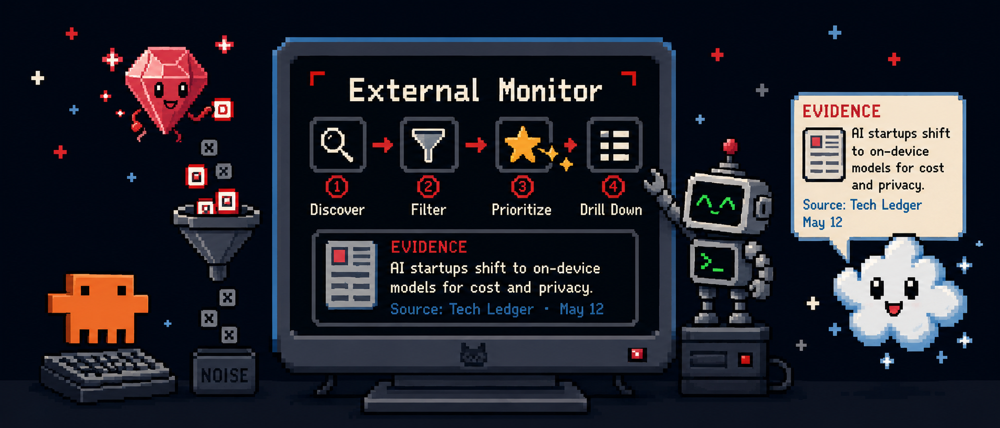
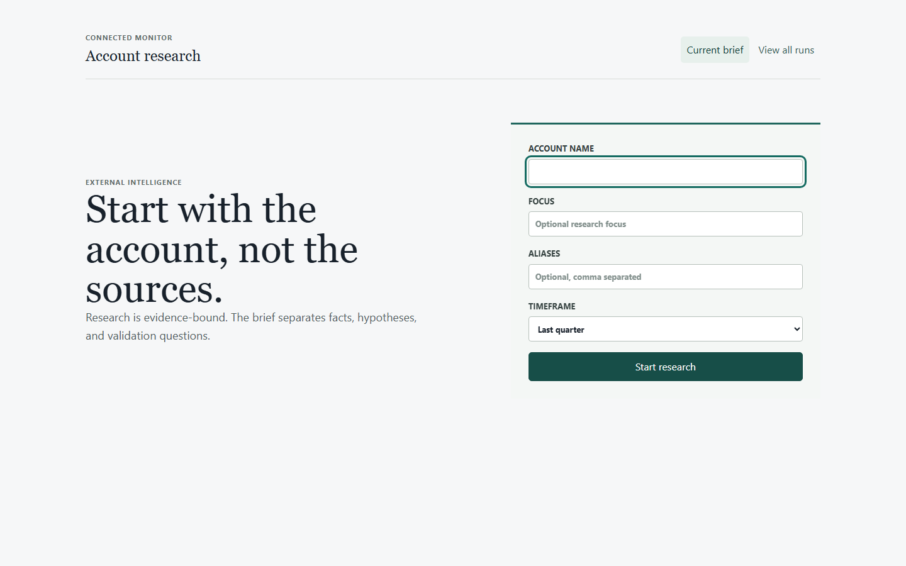
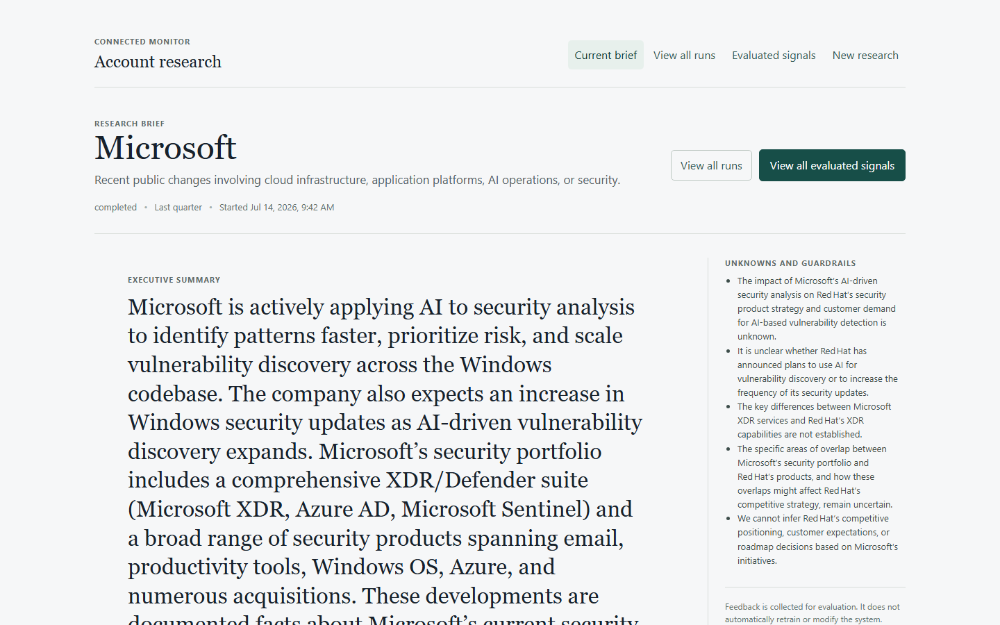

<p align="center">
  
  <br>
  <sub>The hero depicts the product direction. Connected Monitor v1 remains the evidence and ingestion foundation; the current workspace adds an account-agnostic research path above it.</sub>
</p>

# External Account Signal Monitor

[](https://github.com/uzch/external-monitor/actions/workflows/check.yml)


External Account Signal Monitor helps account teams answer:

1. Where should I look?
2. What changed externally?
3. Why might it matter through a bounded Red Hat lens?
4. What should the account team validate next?

The repository contains two connected product surfaces:

- **Connected Monitor v1** is the local source-monitoring and evidence foundation.
- **The current V2 research workspace** accepts an account and focus, runs the FastAPI intelligence path, and presents an evidence-backed Account Signal Brief with a complete evaluated-signal ledger.

The product is account-agnostic. It does not claim customer intent, opportunity, fit, demand, renewal, deployment, ownership, or complete external-world coverage.

## Current Product Surface

| Surface | What it does now | Entry point |
|---|---|---|
| V1 monitor | Registers public RSS/Atom sources, retrieves bounded candidates, persists evidence, and supports local review. | `http://127.0.0.1:8787/` |
| V2 research workspace | Starts or reopens account research, shows the brief, exposes all dispositions, preserves provenance, and captures versioned feedback. | `http://127.0.0.1:8787/research` |
| FastAPI intelligence runtime | Owns V2 orchestration, persistence, provider selection, acquisition, evidence decisions, and brief APIs. | `http://127.0.0.1:8000` |

The current local capability state is truthful and inspectable at `http://127.0.0.1:8000/v2/capabilities`:

- Red Hat MaaS reasoning is available.
- Tavily direct API search and extract are available when local credentials are configured.
- Tavily MCP search and extract are available when the local MCP connection is configured.
- Brave Web and News Search are implemented but unavailable in the current local configuration.
- HTML, PDF, and browser acquisition paths are available.

## See The Current Workflow

The screenshots below are captured from the running application. The README hero above is a protected product asset and is not generated from the UI.

<p align="center">
  
</p>

<p align="center">
  
</p>

## How The Intelligence Path Works

```text
account context
  -> FastAPI research run
  -> MaaS planning and query strategy
  -> Tavily or Brave discovery
  -> controlled HTML, PDF, or browser acquisition
  -> normalized evidence and citations
  -> entity matching and claim decisions
  -> verification, ranking, keep/watch/reject/abstain
  -> bounded relevance hypothesis and validation question
  -> Account Signal Brief and complete ledger
  -> append-only account-team feedback
```

Discovery results are leads, not evidence. Provider snippets and tool results cannot become seller-visible facts until the system acquires the source, extracts bounded evidence, preserves provenance, and validates the claim.

## Why V1 Matters

Connected Monitor v1 is the durable evidence and ingestion foundation. It provides source registration, public-source safety checks, bounded retrieval, local persistence, optional evaluation, ranking, and reviewable evidence records.

That foundation keeps the current research path evidence-bound while allowing discovery, retrieval, verification, and future learning mechanisms to evolve independently.

## What V2 Adds

The current V2 workspace adds a real account-team path on top of the foundation:

- Research runs persist and reopen after refresh or restart.
- The default brief leads with keep and watch signals.
- The complete ledger retains keep, watch, reject, and abstain candidates.
- Every signal preserves fact, evidence, source, dates, verification, uncertainty, rationale, and query/provider provenance.
- Feedback has one current verdict with immutable revision history.
- FastAPI, PostgreSQL, Temporal, MinIO, MaaS, Tavily, Brave, and controlled retrieval are separate capability boundaries.

## Known Limitations

- Provider readiness depends on local configuration and credentials. No secret values belong in GitHub or documentation.
- Brave is implemented but is not available in the current local capability report.
- The runtime is a local single-user implementation, not a deployed enterprise service.
- Advanced learning and policy promotion mechanisms are recorded and controlled, but they do not automatically retrain the system from seller feedback.
- V1 and V2 use separate persistence boundaries while the migration remains in progress.
- The product does not yet provide Salesforce, Slack, email, scheduling, portfolio prioritization, or complete public-web coverage.

## Run Locally

### V1 and the shared frontend

```powershell
npm install
npm run build
npm start
```

Open `http://127.0.0.1:8787/` for V1 or `http://127.0.0.1:8787/research` for V2.

### V2 intelligence runtime

Install the pinned Python environment once, then add local values only to the ignored `.env` file:

```powershell
winget install --id astral-sh.uv --exact
uv python install 3.12
uv --directory intelligence sync --all-groups
docker compose -f compose.intelligence.yml up -d --build
```

Required secret names and provider setup are documented in [docs/INTELLIGENCE_RUNTIME.md](docs/INTELLIGENCE_RUNTIME.md) and [.env.example](.env.example). Never document or commit their values.

## Validate

```powershell
npm run check
uv --directory intelligence run ruff check .
uv --directory intelligence run pytest
```

The canonical frontend check builds the app, runs TypeScript and unit validation, and runs the browser checks with isolated test data. The Python commands validate the FastAPI runtime separately.

## Repository Map

| Need | Start here |
|---|---|
| Product promise and current scope | [`docs/PRODUCT.md`](docs/PRODUCT.md) |
| Runtime topology and migration boundary | [`docs/ARCHITECTURE.md`](docs/ARCHITECTURE.md) |
| Start, inspect, and validate V2 | [`docs/INTELLIGENCE_RUNTIME.md`](docs/INTELLIGENCE_RUNTIME.md) |
| Intelligence quality bar | [`docs/INTELLIGENCE_ARCHITECTURE_QUALITY.md`](docs/INTELLIGENCE_ARCHITECTURE_QUALITY.md) |
| Data contracts | [`docs/DATA_CONTRACTS.md`](docs/DATA_CONTRACTS.md) |
| Source interpretation limits | [`docs/SOURCE_BOUNDARIES.md`](docs/SOURCE_BOUNDARIES.md) |
| Node V1 server and ingestion | [`server/`](server/) |
| FastAPI runtime | [`intelligence/`](intelligence/) |
| Seller workspace | [`src/ui/AutonomousResearchPage.tsx`](src/ui/AutonomousResearchPage.tsx) |
| Current UI snapshots | [`docs/assets/`](docs/assets/) |
| Repeatable repo-experience review | [`.agents/skills/repo-experience-design/SKILL.md`](.agents/skills/repo-experience-design/SKILL.md) |

## Product Direction

V1 remains the compatibility and evidence foundation. V2 is the current account-agnostic research workspace and runtime direction. The long-term product is an autonomous external-intelligence system that discovers where to look, verifies evidence, reasons through bounded relevance, learns through measured evaluation, and stays honest about uncertainty.
