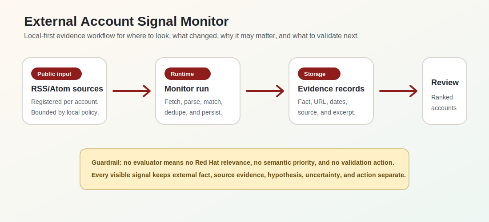
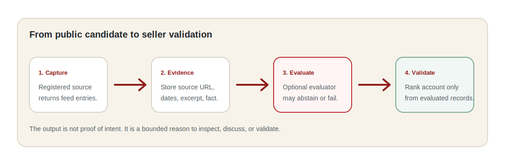

<p align="center">
  
  <br>
  <sub>Hero depicts the product direction. Connected Monitor v1 currently supports registered public sources, bounded evidence capture, optional evaluation, ranking, and drill-down review.</sub>
</p>

# External Account Signal Monitor

[](https://github.com/uzch/external-monitor/actions/workflows/check.yml)


External Account Signal Monitor is a local-first tool for account teams who need to answer four questions quickly.

1. Where should I look?
2. What changed?
3. Why might it matter through a Red Hat lens?
4. What should I validate next?

It stores bounded public-source evidence locally and is being evolved into an autonomous research workflow that produces account-team signal briefs.
RSS/Atom monitoring and legacy imports remain ingestion substrate, not the seller workflow.
It does not claim full external-world coverage, customer intent, opportunity, fit, demand, renewal, deployment, ownership, or complete account coverage.

<p align="center">
  
</p>

## Why It Exists

Account teams do not need another noisy feed.
They need a small number of evidence-backed reasons to inspect an account and a clear next validation step.

This project turns public external signals into a reviewable local workflow.
It is designed so source retrieval, evaluation, ranking, storage, and UI delivery can each be replaced without weakening the evidence boundary.

## What V1 Does

| Capability | Current behavior | Guardrail |
|---|---|---|
| Account setup | Add local monitored accounts and aliases. | Mapping confidence stays explicit. |
| MaaS probe | Validate a configured Red Hat Demo Platform model for structured planning, extraction, evaluation, and verification. | The probe is executable and does not claim live research is ready. |
| Retrieval probe | Safely retrieve and normalize public HTML and PDFs. | Public URLs are validated and private network targets are rejected. |
| Live research | Pending an approved public-web search capability with citations. | No JSON, RSS-only, or externally prepared substitute is presented as autonomous research. |
| Signal brief | Render top signals, watch items, rejected noise, evidence, validation questions, and feedback. | Rejected noise is visible but not promoted as a validation target. |
| Source setup | Register public RSS/Atom sources per account as an ingestion substrate. | URLs are validated and private network targets are rejected. |
| Retrieval | Run bounded local monitor jobs when registered feeds are useful. | Candidates remain evidence records until evaluated. |
| Evaluation | Optional configured HTTP evaluator can produce semantic records. | No evaluator means no Red Hat relevance or priority claim. |
| Ranking | Account summaries rank only evaluated evidence-backed records. | Unevaluated candidates do not become intent signals. |
| Review | Account detail leads with the Account Signal Brief and keeps monitor records under debug/admin context. | External events are never treated as proof of customer plans. |

## Why V1 Matters

Connected Monitor v1 is the evidence and ingestion foundation.
It is valuable because it creates the durable boundary layer: source registration, bounded retrieval, local persistence, optional evaluation, account ranking, and reviewable evidence records.

That foundation is what lets later discovery, feedback, and prioritization work stay evidence-bound instead of becoming another noisy or overclaiming feed.

## What V1 Does Not Do Yet

Connected Monitor v1 is not the final product vision.
It does not yet perform intelligent public-source discovery, feedback learning, agentic prioritization, Salesforce delivery, Slack delivery, email delivery, automatic outreach, opportunity creation, forecasting, or intent detection.

Those future capabilities should attach through replaceable adapters and review workflows without weakening the separation between external fact, source evidence, Red Hat relevance hypothesis, and validation action.

## Current Iteration Status

- Real Red Hat MaaS connectivity is working through the configured local endpoint and API key.
- Four authorized MaaS models have measured benchmark results in [docs/MAAS_MODELS.md](docs/MAAS_MODELS.md).
- Safe public HTML and PDF retrieval is implemented and probeable locally.
- Structured-output compatibility is partial and model-specific. It is not yet reliable enough for autonomous research promotion.
- Live public-web search with citations remains unresolved, so this is not yet an intelligent autonomous research product.
- Frontend work is frozen except for wiring truthful backend states and outputs into the existing seller-facing views.
- The next phase is an account-agnostic, backend-first autonomous intelligence runtime, likely using FastAPI once the live-search path is confirmed.

## Quick Start

```bash
npm install
npm run build
npm start
```

Open `http://127.0.0.1:8787`.

Local runtime data is stored in `local-data/connected-monitor.sqlite` by default.
`local-data/` is ignored by Git.

## First Walkthrough

1. Add an account.
2. Add one or more aliases that appear in public source text.
3. Open the account detail page.
4. Review research readiness on the account page.
5. Configure and run the MaaS probe with `npm run probe:maas`.
6. Run a public retrieval probe with `npm run probe:retrieval -- <public-url> ...`.
7. Enable live autonomous research only after an approved public-web search capability is configured.

If no evaluator is configured, candidates stay in the awaiting evaluation section.
That is expected and intentional.

## Signal Lifecycle

<p align="center">
  
</p>

## Configuration

Copy `.env.example` when you want local overrides.

See [MaaS model evaluation](docs/MAAS_MODELS.md) for non-secret model configuration, methodology, and measured benchmark results.

```text
CM_PORT=8787
CM_DATABASE_PATH=local-data/connected-monitor.sqlite
CM_SEED_CONFIG_PATH=local-data/seed.json
CM_SOURCE_MIN_INTERVAL_MINUTES=30
CM_SOURCE_TIMEOUT_MS=8000
CM_SOURCE_MAX_ENTRIES=25
CM_SOURCE_MAX_RESPONSE_BYTES=1000000
CM_EVALUATOR_BASE_URL=
CM_EVALUATOR_API_KEY=
CM_EVALUATOR_MODEL=
CM_EVALUATOR_TIMEOUT_MS=15000
CM_MAAS_BASE_URL=
CM_MAAS_API_KEY=
CM_MAAS_MODEL=
CM_MAAS_TIMEOUT_MS=30000
```

An ignored seed file can create local runtime accounts and source registrations.

```json
{
  "accounts": [
    {
      "name": "Example Corp",
      "aliases": ["Example"],
      "sector": "Financial services",
      "sources": [
        {
          "displayName": "Example public feed",
          "url": "https://example.com/feed.xml"
        }
      ]
    }
  ]
}
```

## Repository Map

| If you want to understand... | Start here |
|---|---|
| Product goal and user value | [`docs/PRODUCT.md`](docs/PRODUCT.md) |
| Architecture and replaceable boundaries | [`docs/ARCHITECTURE.md`](docs/ARCHITECTURE.md) |
| Data contracts and validation rules | [`docs/DATA_CONTRACTS.md`](docs/DATA_CONTRACTS.md) |
| Source interpretation limits | [`docs/SOURCE_BOUNDARIES.md`](docs/SOURCE_BOUNDARIES.md) |
| Runtime server and ingestion | [`server/`](server/) |
| Connected UI and API client | [`src/ui/`](src/ui/) and [`src/services/connectedApi.ts`](src/services/connectedApi.ts) |
| E2E behavior | [`tests/e2e/`](tests/e2e/) |
| Synthetic foundation fixtures | [`fixtures/README.md`](fixtures/README.md) |
| Known follow-ups and future direction | [`docs/PRODUCT.md`](docs/PRODUCT.md) |
| Repo experience review loop | [`.agents/skills/repo-experience-design/SKILL.md`](.agents/skills/repo-experience-design/SKILL.md) |

## Checks

```bash
npm run build
npm run test
npm run test:e2e
npm run check
```

The E2E check uses an isolated temporary SQLite database and the local API server.

## Project Direction

Connected Monitor v1 is the ingestion and evidence foundation.
Manual account and source registration is a bootstrap path, not the intended final seller workflow.

The next product direction is intelligent public-source discovery, feedback learning, and agentic prioritization.
Those capabilities should attach through replaceable adapters and review workflows while preserving the separation between external fact, source evidence, Red Hat relevance hypothesis, and validation action.
